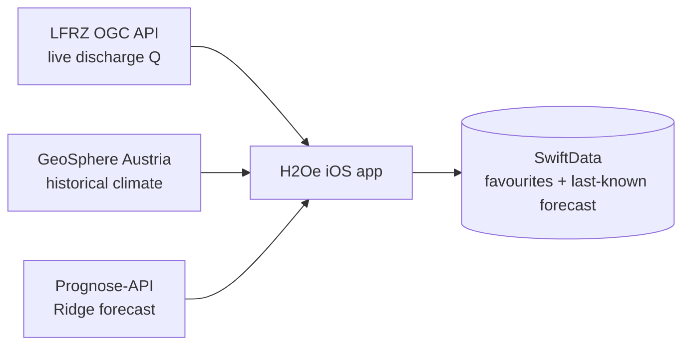

# H2Oe

**H2Oe** is an iOS app that shows the current flood situation for the rivers of
**Lower Austria (Niederösterreich)** and forecasts river discharge for the next
three days. It combines live gauge readings, historical meteorology, and a
machine-learning discharge/flood forecast into a single, glanceable view.

The forecast model is the **Ridge** model from the companion research
repository
[ChristinaSoM/multistation-flood-forecasting](https://github.com/ChristinaSoM/multistation-flood-forecasting),
served as an HTTP prediction API (see [Forecast model & API](#forecast-model--api)).

## Features

- **Live discharge stations** — current discharge (Q, m³/s) for Lower-Austrian
  gauging stations, pulled from the state's official LFRZ OGC API Features service.
- **3-day discharge forecast** — predicted discharge at four lead times
  (**0 / 24 / 48 / 72 h**) per station, from the Ridge model.
- **Flood warning levels** — each station derives a severity from the forecast's
  HQ flood-exceedance flags. Warnings start at **HQ5** and are colour-coded
  **yellow (HQ5) → orange (HQ30) → red (HQ100+)**, shown on the map markers and
  as a badge on every station; an icon + label back up the colour (never colour alone).
- **AI transparency** — a first-launch notice (EU AI Act, Art. 50) plus an inline
  hint disclose that forecasts and warnings are AI-generated and not official.
- **Favourites, offline-capable** — mark stations as favourites; their last-known
  measured values *and* last-known forecast are persisted on device (SwiftData),
  so favourites still show meaningful data without a network connection.
- **Station detail** — GeoSphere climate parameter cards (precipitation,
  temperature, wind, sunshine, …), the discharge forecast, and a map location.
- **Map** — MapKit map of stations with favourites highlighted.
- **Info tab** — flood-behaviour guidance, emergency contacts, and data-source
  attribution.

The UI is organised into four tabs: **Home**, **Stations**, **Favourites**,
**Info**.

## Architecture



The app talks to three backends:

| Source | What | Base URL |
|--------|------|----------|
| **LFRZ OGC API Features** (Land NÖ) | Live discharge (Q) stations, filtered via CQL2 (`parameter='Q' AND hydrodienst='Niederösterreich'`) | `https://gis.lfrz.gv.at/api/geodata/i000501/ogc/features/v1/collections/i000501:pegel_aktuell/items` |
| **GeoSphere Austria** | Historical 10-min climate parameters per station | `https://dataset.api.hub.geosphere.at/v1/station/historical/klima-v2-10min` |
| **H2Oe Prognose-API** | Ridge discharge/HQ forecast | `https://h2oe-prognose.duckdns.org` |

Networking uses **Alamofire**; persistence lives in a local Swift Package,
**`DataProvider`**, which owns the SwiftData schema (`FavoriteStation`,
`StoredForecast`) and the `FavoriteStationRepository`.

## Forecast model & API

### The model

The served model is the **Ridge baseline** (RidgeCV over hand-engineered
features across a 168-hour input window) from the companion repository, a
master's-thesis project on multi-station, multi-horizon flood forecasting for
Lower Austria. It predicts discharge at 0/24/48/72 h lead times and, where the
serving head carries them, HQ flood-exceedance probabilities. Past discharge is
deliberately excluded from the model inputs, so it learns a genuine
rainfall-runoff mapping.

Repository: <https://github.com/ChristinaSoM/multistation-flood-forecasting>

### Hosting

The Ridge model (`ridge_serving.json`) is **baked into a Docker image** that the
companion repo builds and publishes to the GitHub Container Registry
(`ghcr.io/christinasom/h2oe-prognose-api`). The container serves the API on port
`8000`; the public instance the app connects to is exposed over HTTPS via
DuckDNS dynamic DNS at **`https://h2oe-prognose.duckdns.org`**. Deployment is
automated in the companion repo (serve workflow + Ansible playbook).

### Connecting

All endpoints are plain HTTPS `GET` requests returning JSON with ISO-8601
(naive UTC) timestamps.

| Endpoint | Purpose |
|----------|---------|
| `GET /predict_batch?stations=<hzbnr,hzbnr,…>[&horizon=0\|24\|48\|72]` | **Primary path** — one request for all live stations on app open (keeps the server's per-IP rate limit from being hit). |
| `GET /predict?station=<hzbnr>[&horizon=…]` | Single-station **fallback** (e.g. a favourite missing from the batch, retried when its detail view opens). |
| `GET /health`, `GET /ready` | Liveness / readiness probes. |

`hzbnr` is the station's HZB number (the app parses it from the API station id,
e.g. `Q207241__…` → `207241`). Omit `horizon` to receive all four lead times.

Example:

```bash
curl "https://h2oe-prognose.duckdns.org/predict?station=207241&horizon=0"
```

```json
{
  "station": "Q207241__GW331298__GEO4030",
  "issued_at": "2026-08-23T15:00:00",
  "cached": false,
  "count": 1,
  "predictions": [
    { "station": "Q207241__GW331298__GEO4030",
      "issue_time": "2026-08-23T15:00:00",
      "valid_time": "2026-08-23T15:00:00",
      "horizon_h": 0,
      "q_pred": 1045.77 }
  ]
}
```

On the app side this is implemented in `H2Oe/Networking/ForecastService.swift`
(the API client) and exposed to the UI through the observable `ForecastStore`.
Every failure maps to a user-facing `ForecastError` message (rate-limited,
service unavailable, transport, decoding).

## Project structure

```
H2Oe/                     Xcode project (the iOS app)
  H2Oe/
    H2OeApp.swift          App entry; builds the shared SwiftData ModelContainer
    ForecastStore.swift    Observable forecast state (batch load on open)
    Models/                Codable API models (discharge, GeoSphere, forecast)
    Networking/            Alamofire clients (WFS, GeoSphere, Prognose-API)
    Views/                 SwiftUI views (tabs, station detail, map, cards)
DataProvider/             Local Swift Package: SwiftData schema + repository
```

## Build & run

- **Xcode 26** (Swift 6.3) or newer.
- Provide a `Secrets.xcconfig` at `H2Oe/Secrets.xcconfig` defining the WFS API
  key. It is injected into the app's Info.plist as `WFS_API_KEY` and read at
  runtime via `Bundle.main.object(forInfoDictionaryKey: "WFS_API_KEY")`:

  ```
  WFS_API_KEY = your-lfrz-wfs-key
  ```

  The forecast and GeoSphere APIs need no key.
- Open `H2Oe/H2Oe.xcodeproj`, select the `H2Oe` scheme, and run on an iOS
  simulator or device. Swift package dependencies (Alamofire, the local
  `DataProvider`) resolve automatically.

## Tests & CI

The persistence layer is unit-tested with swift-testing:

```bash
swift test --package-path DataProvider
```

GitHub Actions (`CI`) builds the iOS app and runs the `DataProvider` tests on
every push to `main`.

## Data sources & attribution

- **Land Niederösterreich – Open Government Data:** <https://www.noe.gv.at/noe/Open-Government-Data/Datenkatalog.html>
- **GeoSphere Austria:** <https://www.geosphere.at/de>
- Emergency information (Austria): <https://www.oesterreich.gv.at/de/themen/notfaelle_unfaelle_und_kriminalitaet/katastrophenfaelle.html>
